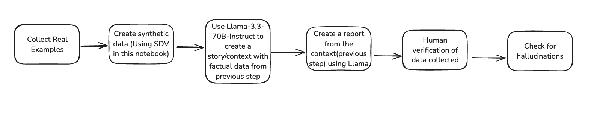

# Creating Evals with synthetic data and measuring hallucinations

When you deploy Llama for your use case, it is a good practice to have Evals for your use case. In an ideal world, you want to have human annotated Evals. If for some reason, this is not possible, this notebook shows a strategy for how one might go about addressing Evals using synthetic data. However, the Evals generated still require validation by a human to make sure that your revenue generating production use case can rely on this. 
The notebook also shows how one could accurately measure hallucinations without using LLM-As-A-Judge methodology using Llama


## Overall idea

Let's assume we have a use case for generating a summarization report based on a given context, which is a pretty common use case with LLM. Both the context and the report have a lot of factual information and we want to make sure the generated report is not hallucinating.

Since its not trivial to find an open source dataset for this, the idea is to take synthetic tabular data and then use Llama to generate a story(context) for every row of the tabular data using Prompt Engineering. Then we ask Llama to summarize the generated context as a report in a specific format using Prompt Engineering. Finally we check the factual accuracy of the generated report using Llama by converting this into a QA task using the tabular data as the ground truth.

To generate synthetic data for this approach, we use an open source tool like [Synthetic Data Vault(SDV)](https://github.com/sdv-dev/SDV)

The overall workflow is shown in the below diagram



- 

## Example Context & Report

### Ground Truth

```
Unnamed: 0	start_date	end_date	salary	duration	student_id	high_perc	high_spec	mba_spec	second_perc	gender	degree_perc	placed	experience_years	employability_perc	mba_perc	work_experience	degree_type
0	0	2020-01-10	NaN	NaN	3.0	3040587	66.62	Science	Mkt&Fin	75.01	M	75.76	True	1	85.98	58.37	True	Sci&Tech
```

### Context

We use `Llama-3.3-70B-Instruct` to generate the following using Prompt Engineering

```
### Progress Report for Student 3040587
#### <academic_background>
Student 3040587 has a strong academic foundation, with a high school percentage of 66.62% in Science. He also holds a degree in Science and Technology with a percentage of 75.76%. His second-year percentage is 75.01%, demonstrating his consistent academic performance. 
#### <career_aspirations>
With a specialization in Marketing and Finance, Student 3040587 aspires to pursue a career in the finance sector, leveraging his skills in market analysis and financial planning. His career goal is to become a financial analyst, with a focus on investment banking. 
#### <salary_expectations>
Student 3040587 expects a starting salary of 5000 tokens per annum, considering his one year of work experience and academic achievements. He is confident that his skills and knowledge will enable him to secure a job with a reputable company. 
#### <placement_status>
Student 3040587 has been successfully placed, with an employability percentage of 85.98%. His placement is a testament to his hard work and dedication to his studies, as well as his relevant work experience. 
#### <course_details>
Student 3040587 is currently pursuing an MBA with a specialization in Marketing and Finance, with a course duration of 3 years. He has completed one year of the course, with an MBA percentage of 58.37%. 
#### <story_behind_the_numbers>
Behind the numbers, Student 3040587's story is one of perseverance and determination. Despite facing challenges in his academic journey, he has consistently worked hard to achieve his goals. His work experience has equipped him with the skills and knowledge required to succeed in the finance sector. With his strong academic background, career aspirations, and relevant work experience, Student 3040587 is poised to achieve great things in his future career. 
### End of Report 3040587
```

### Report

We use `Llama-3.3-70B-Instruct` to generate the following report from the above context using Prompt Engineering

```
Summary Report:

<student_id>
Student 3040587
<student_id>

<salary>
Student has a realistic salary expectation of 5000 tokens per annum
<salary>

<degree_type>
Student has a degree in Science and Technology
<degree_type>

<mba_spec>
Student has a specialization in Marketing and Finance
<mba_spec>

<duration>
Student has a degree duration of 3 years
<duration>

<employability_perc>
Student has a 85.98% employability percentage
<employability_perc>
```

## Manual validation of Eval Dataset

We create an Eval Data set using Llama with the `Context` and its corresponding `Report` as shown above. Once we have sufficient samples, it is important to validate that the data generated is in the expected format and has no factual errors. It is recommended that this step be done by a human till AGI becomes a reality.

## Measuring Hallucinations

The usual method to measure hallucinations uses LLM-As-Judge methodology. An example hallucination metric is using [DeepEval](https://www.deepeval.com/docs/metrics-hallucination).
This would use a powerful LLM as the ground truth to measure hallucinations.

This notebook shows a  simple way to measure hallucinations using the ground truth data that we have (tabular data). The methodology is to make use of the tags that we have added in the report and use Llama to answer simple questions looking at the corresponding sections. Llama compares the answers with the ground truth and generates a list of boolean values. This is then used to measure accuracy of the factual information in the report. If your report has a well defined structure, using QA to measure hallucinations can be highly effective and cost efficient

### Example 

Below is an example of the expected output while checking for hallucinations in the generated report. Since we converted the hallucination measurement task into a list of QA with `True`/`False` outcomes, we can use `accuracy_score` from `sklearn` to measure the accuracy in terms of a single number.

```
Checking accuracy of generated report in generated_data/data_6.json

<answer>
student_id: [False, report shows Student ID is not mentioned in the data and ground truth says 6180804]
degree_type: [True, None]
salary: [True, None]
mba_spec: [True, None]
duration: [True, None]
employability_perc: [True, None]
</answer>
```

## Conclusion & Next Steps

- Creating good quality Evals for extractive summarization is challenging but important
- Llama can be used to create evals given few samples of ground truth
- Using simple QA to measure hallucinations can be an effective strategy to be be confident that important factual information is being verified 