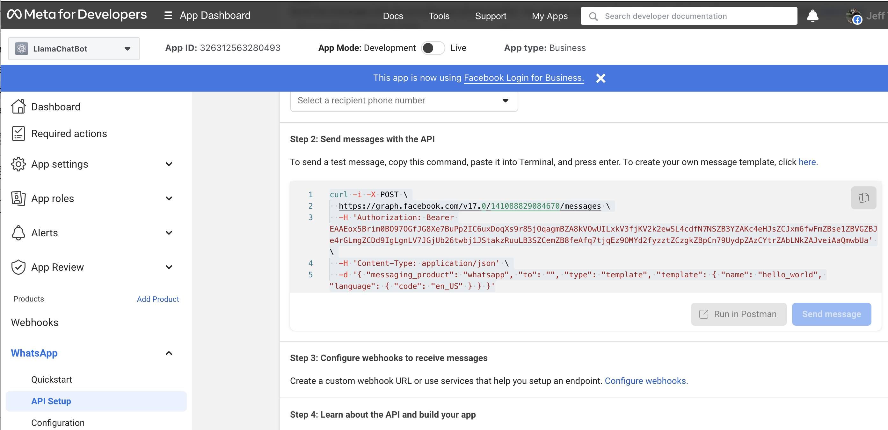

# WhatsApp and Llama 4 APIs : Build your own multi-modal chatbot

Welcome to the WhatsApp Llama4 Bot ! This bot leverages the power of the Llama 4 APIs to provide intelligent and interactive responses to users via WhatsApp. It supports text, image, and audio interactions, making it a versatile tool for various use cases.


## Key Features
- **Text Interaction**: Users can send text messages to the bot, which are processed using the Llama4 APIs to generate accurate and contextually relevant responses.
- **Image Reasoning**: The bot can analyze images sent by users, providing insights, descriptions, or answers related to the image content.
- **Audio-to-Audio Interaction**: Users can send audio messages, which are transcribed to text, processed by the Llama4, and converted back to audio for a seamless voice-based interaction.


## Technical Overview

### Architecture

- **FastAPI**: The bot is built using FastAPI, a modern web framework for building APIs with Python.
- **Asynchronous Processing**: Utilizes `httpx` for making asynchronous HTTP requests to external APIs, ensuring efficient handling of media files.
- **Environment Configuration**: Uses `dotenv` to manage environment variables, keeping sensitive information like API keys secure.

Please refer below a high-level of architecture which explains the integrations :


### Important Integrations

- **WhatsApp API**: Facilitates sending and receiving messages, images, and audio files. 
- **Llama4 Model**: Provides advanced natural language processing capabilities for generating responses.
- **Groq API**: Handles speech-to-text (STT) and text-to-speech (TTS) conversions, enabling the audio-to-audio feature.


## Here are the steps to setup with WhatsApp Business Cloud API


First, open the [WhatsApp Business Platform Cloud API Get Started Guide](https://developers.facebook.com/docs/whatsapp/cloud-api/get-started#set-up-developer-assets) and follow the first four steps to:

1. Add the WhatsApp product to your business app;
2. Add a recipient number;
3. Send a test message;
4. Configure a webhook to receive real time HTTP notifications.

For the last step, you need to further follow the [Sample Callback URL for Webhooks Testing Guide](https://developers.facebook.com/docs/whatsapp/sample-app-endpoints) to create a free account on glitch.com to get your webhook's callback URL.

Now open the [Meta for Develops Apps](https://developers.facebook.com/apps/) page and select the WhatsApp business app and you should be able to copy the curl command (as shown in the App Dashboard - WhatsApp - API Setup - Step 2 below) and run the command on a Terminal to send a test message to your WhatsApp.



Note down the "Temporary access token", "Phone number ID", and "a recipient phone number" in the API Setup page above, which will be used later.


## Setup and Installation


### Step 1: Clone the Repository

```bash
git clone https://github.com/meta-llama/llama-cookbook.git
cd llama-cookbook/end-to-end-use-cases/whatsapp-llama4-bot
```

### Step 2: Install Dependencies

Ensure you have Python installed, then run the following command to install the required packages:

```bash
pip install -r requirements.txt
```


### Step 3: Configure Environment Variables

Create a `.env` file in the project directory and add your API keys and other configuration details as follows:

```plaintext
ACCESS_TOKEN=your_whatsapp_access_token
WHATSAPP_API_URL=your_whatsapp_api_url
TOGETHER_API_KEY=your_llama4_api_key
GROQ_API_KEY=your_groq_api_key
PHONE_NUMBER_ID=your_phone_number_id
```


### Step 4: Run the Application

On your EC2 instance, run the following command on a Terminal to start the FastAPI server 

```bash
uvicorn ec2_endpoints:app —host 0.0.0.0 —port 5000
```

Note: If you use Amazon EC2 as your web server, make sure you have port 5000 added to your EC2 instance's security group's inbound rules.


## License

This project is licensed under the MIT License.


## Contributing

We welcome contributions to enhance the capabilities of this bot. Please feel free to submit issues or pull requests.


